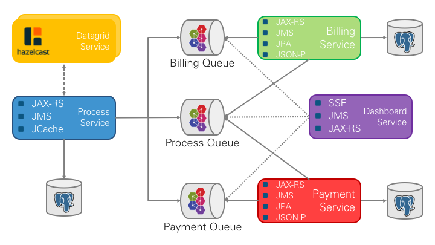

image:https://travis-ci.org/lreimer/cloud-native-javaee.svg?branch=master["Build Status", link="https://travis-ci.org/lreimer/cloud-native-javaee"]
image:https://img.shields.io/badge/license-MIT%20License-blue.svg["MIT License", link=https://github.com/lreimer/cloud-native-javaee/blob/master/LICENSE"]

= Cloud Native Java EE Showcase

This showcase demonstrates how to build a cloud native application using Java EE and
selected open source components from Netflix OSS. The individual parts will later
be deployed and run using Docker, Kubernetes and DC/OS.



== Build instructions

In order to compile and run the examples you do not need much. A recent JDK8 needs to
be available in your SEU.
```shell
$ ./gradlew clean build
```

== Running the Cloud Native Java EE showcase

=== Locally

The showcase can be run on your local machine as well as using Docker Compose, Minikube
or Minishift.

```
$ docker-compose up -d --build
```

=== Google Container Engine

- Install the gcloud SDK for Mac (or Windows)
- Make sure you have a project with billing activated as well as the container engine management API
- Make sure you have `kubectl` installed, either using `gcloud` or using `brew` et.al.

```
$ gcloud config list project
$ gcloud config set compute/zone europe-west1-b
$ gcloud config set container/use_client_certificate False

$ gcloud container clusters create cloud-native-javaee --num-nodes=5 --enable-autoscaling --min-nodes=5 --max-nodes=7

$ gcloud container clusters describe cloud-native-javaee

$ gcloud auth application-default login
$ kubectl cluster-info
```

Once you are done, remember to delete the cluster again!
```
$ gcloud container clusters delete cloud-native-javaee
```


== References

* https://www.jcp.org/en/jsr/detail?id=236[JSR 236: Concurrency Utilities for Java EE 1.0]
* https://github.com/Netflix/Hystrix[Netflix/Hystrix]
* https://www.jcp.org/en/jsr/detail?id=339[JSR 339: JAX-RS 2.0]
* https://www.jcp.org/en/jsr/detail?id=346[JSR 346: Contexts and Dependency Injection for Java EE 1.1]
* https://github.com/Netflix/ribbon[Netflix/ribbon]

== Maintainer

M.-Leander Reimer (@lreimer)

== License

This software is provided under the MIT open source license, read the `LICENSE` file for details.
